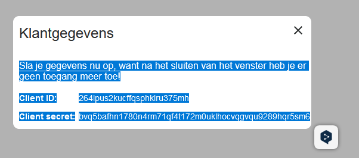

# vip-data-prep

## Setup
1. Copy `.env.template` to `.env`
2. Fill in your API credentials in `.env`
3. Install dependencies: `pip install -r requirements.txt`


## Run locally with reload
```bash
streamlit run src/app.py
```

## Pre-commit
```bash
pre-commit run --all-files
```

## Docker
```bash
docker build -t  .
docker run -p 8501:8501 vip-data-prep
```

## Docker Compose
```bash
docker-compose up
```

## Docker Compose Rebuid
```bash
docker-compose up --build
```

## Docker Compose Down
```bash
docker-compose down
```


Sla je gegevens nu op, want na het sluiten van het venster heb je er geen toegang meer toe!
Client ID:264lpus2kucffqsphklru375mh
Client secret:bvq5bafhn1780n4rm71qf4t172m0uklhocvqgvqu9289hqr5sm6
